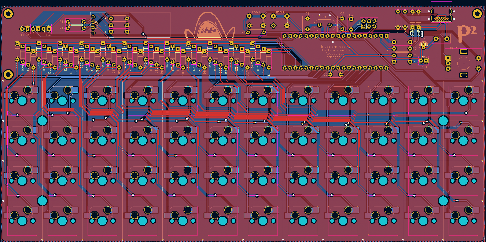

# plondo

a plaid inspired 4x12 ortholinear keyboard with a rotary encoder and oled panel.

building plondo? then start at the [BOM](docs/1-bom.md)!

this is a work in progress by me, someone who is a software engineer and very much not qualified to do this kind of
thing. i'm going to do it anyway.

if you're missing symbols/footprints then make sure you run `git submodule init && git submodule update` to pull the
relevant libraries down.

this keyboard derives from the [plaid](https://github.com/hsgw/plaid) and the
[mysterium](https://github.com/coseyfannitutti/mysterium).
